---
## Author
author:
  name: Лобанова Екатерина Евгеньевна
  degrees: DSc
  orcid: 0000-0002-0877-7063
  email: 1032252596@rudn.ru
  affiliation:
    - name: Российский университет дружбы народов
      country: Российская Федерация
      postal-code: 117198
      city: Москва
      address: ул. Миклухо-Маклая, д. 6

## Title
title: "Лабораторная работа 1"
license: "CC BY"
---

# Цель работы

Целью данной работы является приобретение практических навыков установки операционной системы на виртуальную машину, настройки минимально необходимых для дальнейшей работы сервисов.
# Задание

Установка ОС Линукс Федора Свей

# Выполнение лабораторной работы

Устанавливаем ВМ указываем необходмые настройки. ждем полной загрузки после этого.

Загружаем вм и входим под пользователем котрого создали (рис. @fig:001)
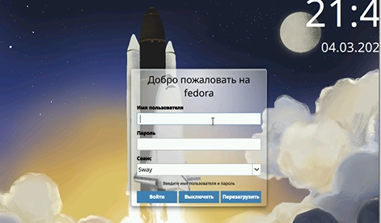{#fig:001 width=70%}

Нажимаем комбинацию Win+Enter для запуска терминала.
Переключаемся на роль супер-пользователя. Установливаем средства разработки (рис.[-@fig:002])
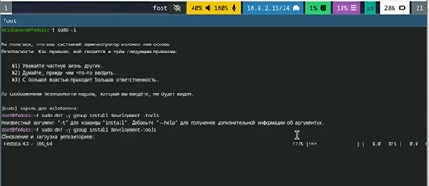{#fig-002 width=70%}

Обновляем все пакеты.  (рис.[-@fig:003])
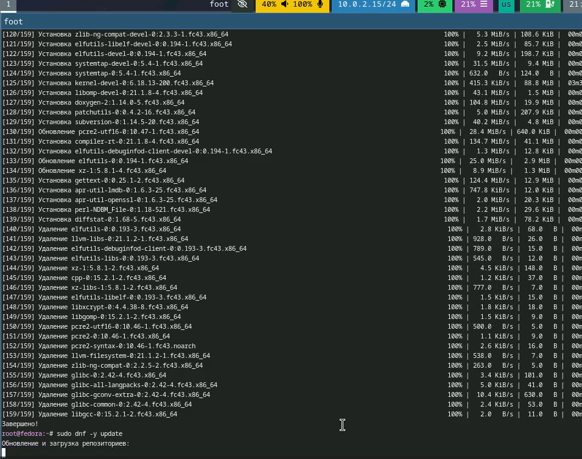{#fig-003 width=70%}

Программы для удобства работы в консоли:(рис.[-@fig:004])
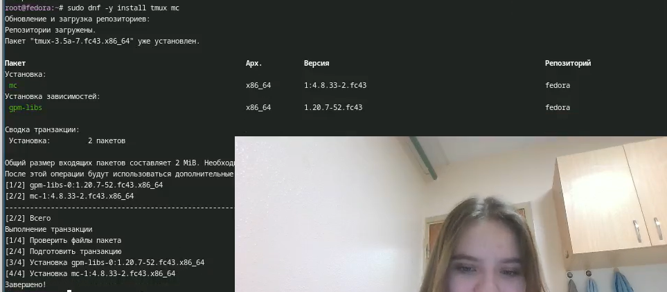{#fig-004 width=70%}

Используем автоматическое обновление.
Устанавливаем программное обеспечение:(рис.[-@fig:005])
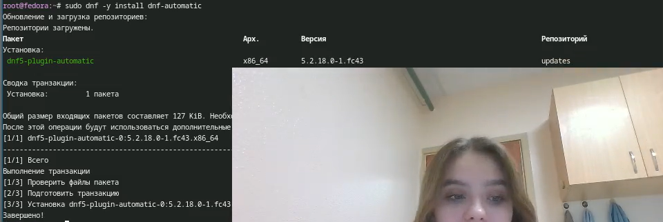{#fig-005 width=70%}

Отключение SELinux

В файле /etc/selinux/config заменяем значение SELINUX=enforcing на значени SELINUX=permissive (рис.[-@fig:006])
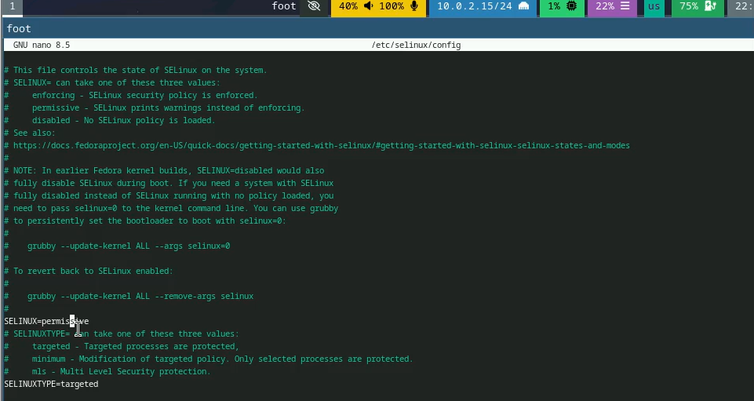{#fig-006 width=70%}

После этого перезапускаем машину, заново в нее входим, открываем терминал.

Запускаем терминальный мультиплексор tmux.Создайте конфигурационный файл ~/.config/sway/config.d/95-system-keyboard-config.conf:mkdir -p ~/.config/sway
touch ~/.config/sway/config.d/95-system-keyboard-config.conf Вводим команду для редакитрования конфигурационого файла ~/.config/sway/config.d/95-system-keyboard-config.conf:(рис.[-@fig:007])
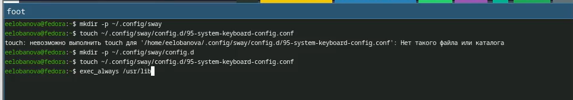{#fig-007 width=70%}

Редактируем файл ~/.config/sway/config.d/95-system-keyboard-config.conf:(рис.[-@fig:008])
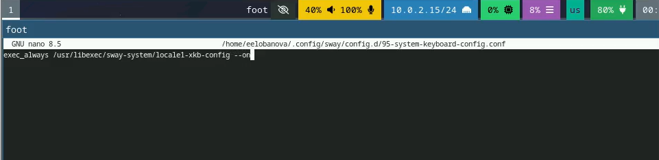{#fig-008 width=70%}

Переключаемся на роль супер-пользователя

Отредактируем конфигурационный файл /etc/X11/xorg.conf.d/00-keyboard.conf: я использую команду nano (рис.[-@fig:009]) (рис.[-@fig:010])
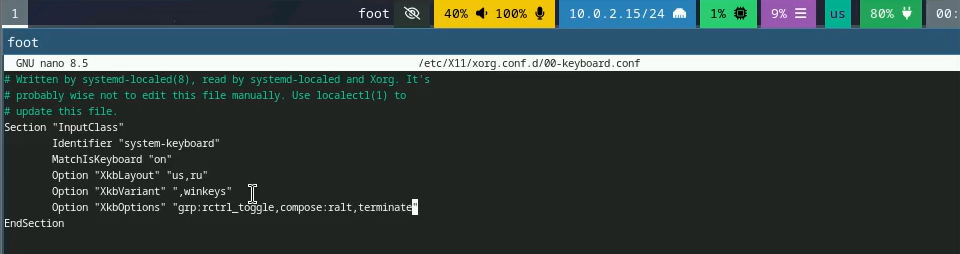{#fig-009 width=70%}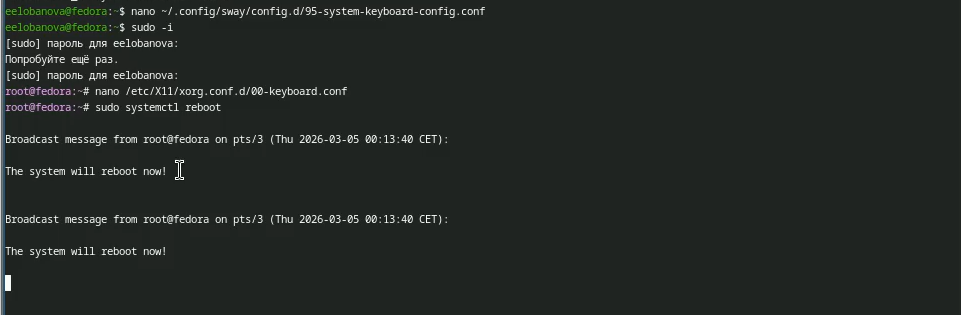{#fig-010 width=70%}
Переключаемся на роль супер-пользователя: sudo -i. Создаем пользователя (вместо username указываем наш логин в дисплейном классе):adduser -G wheel username(рис.[-@fig:01])
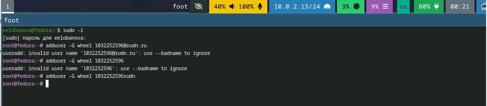{#fig-011 width=70%}

Задаем пароль для пользователя.passwd username(рис.[-@fig:012])
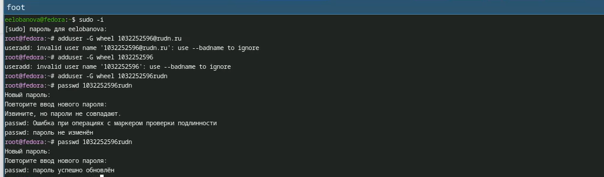{#fig-012 width=70%}

Установливаем имя хоста. Проверяем, что имя хоста установлено верно:(рис.[-@fig:013])
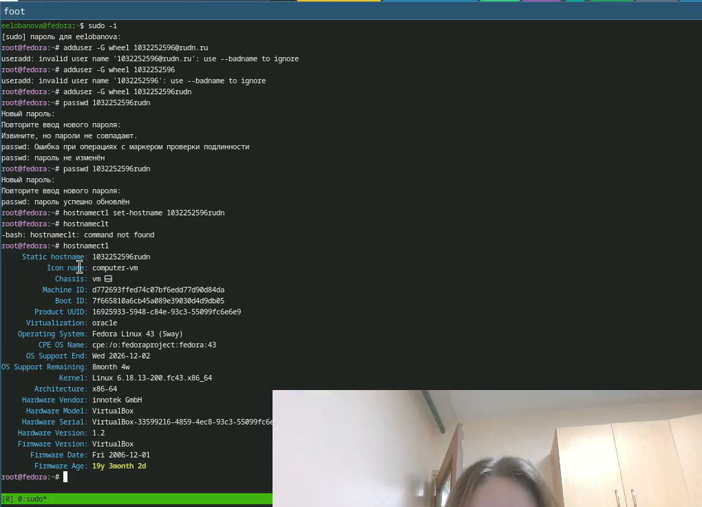{#fig-013 width=70%}

Переключаемся на роль супер-пользователя.Устанавливаем средство pandoc для работы с языком разметки Markdown.(рис.[-@fig:014])
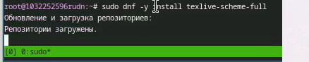{#fig-014 width=70%}

Установка дистрибутиа TeXlive:(рис.[-@fig:015])
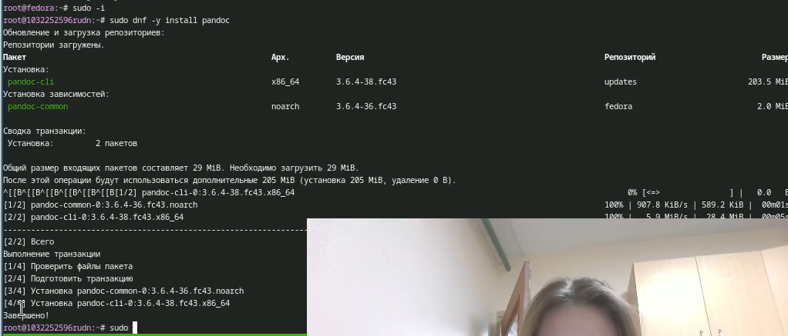{#fig-015 width=70%}
# Домашнее задание

Сморим вывод команды dmesg | less(рис.[-@fig:016])
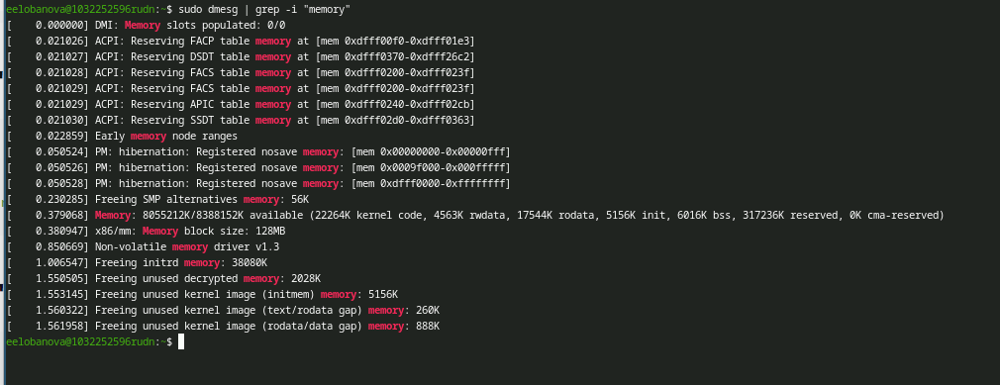{#fig-016 width=70%}

Получаем следующую информацию.
Версия ядра Linux (Linux version).
Частота процессора (Detected Mhz processor).
Модель процессора (CPU0).
Объём доступной оперативной памяти (Memory available).
Тип обнаруженного гипервизора (Hypervisor detected).
Тип файловой системы корневого раздела.
Последовательность монтирования файловых систем.(рис.[-@fig:017])
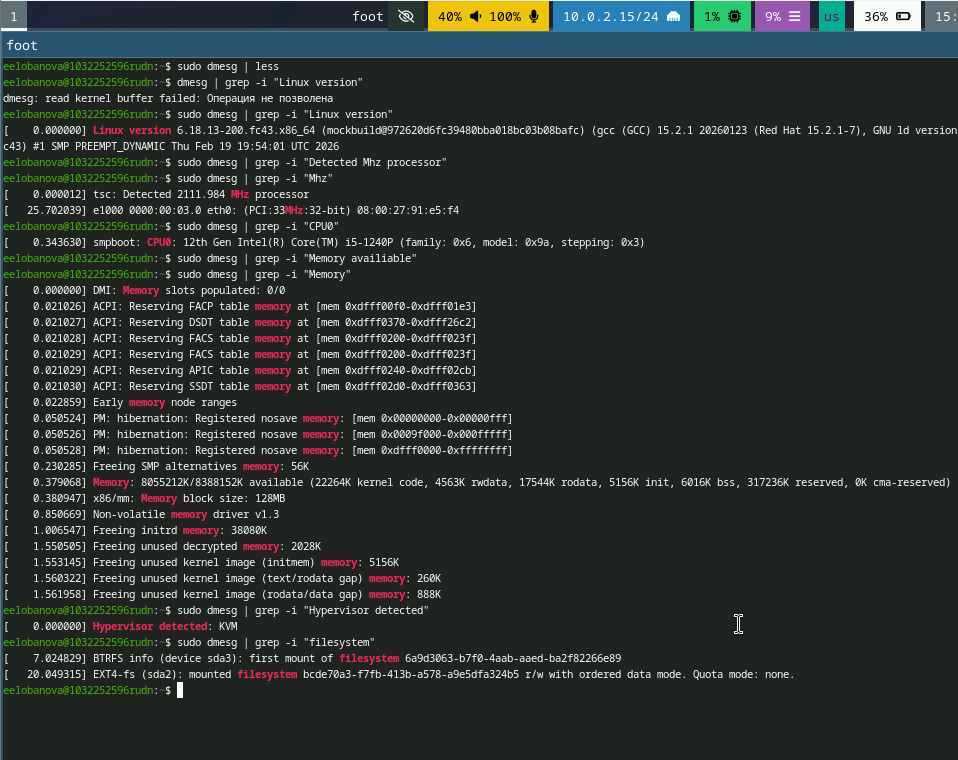{#fig-017 width=70%}

# Контрольные вопросы

Какую информацию содержит учётная запись пользователя?

Укажите команды терминала и приведите примеры:

    для получения справки по команде;
    для перемещения по файловой системе;
    для просмотра содержимого каталога;
    для определения объёма каталога;
    для создания / удаления каталогов / файлов;
    для задания определённых прав на файл / каталог;
    для просмотра истории команд.

Что такое файловая система? Приведите примеры с краткой характеристикой.
Как посмотреть, какие файловые системы подмонтированы в ОС?
Как удалить зависший процесс?
Учётная запись пользователя в Linux (включая Fedora) содержит имя пользователя, UID (идентификатор пользователя), GID (идентификатор основной группы), домашний каталог, путь к командной оболочке и зашифрованный пароль. Эта информация хранится в файлах /etc/passwd и /etc/shadow.

Команды терминала и примеры:
Для получения справки по команде используется man или -h. Пример: man ls или ls --help.
Для перемещения по файловой системе используется cd. Пример: cd /home/username или cd .. для перехода на уровень выше.
Для просмотра содержимого каталога используется ls. Пример: ls -la (покажет все файлы, включая скрытые, с подробной информацией).
Для определения объёма каталога используется du. Пример: du -sh /home/username (покажет общий размер каталога в удобном для чтения формате).
Для создания каталога используется mkdir, для удаления - rm. Пример создания: mkdir newfolder. Пример удаления файла: rm file.txt. Пример удаления каталога: rm -rf oldfolder.
Для задания определённых прав на файл или каталог используется chmod. Пример: chmod 755 script.sh (даст владельцу право на чтение, запись и выполнение, а остальным — только на чтение и выполнение).
Для просмотра истории команд используется history. Пример: history (покажет список ранее введённых команд).

Что такое файловая система. Это способ организации и хранения данных на диске. Примеры: ext4 — стандартная журналируемая ФС для Linux, хороша для надёжности. XFS — высокопроизводительная ФС, хороша для больших файлов. Btrfs — современная ФС с поддержкой снимков и сжатия.

Как посмотреть, какие файловые системы подмонтированы. Используйте команду mount или findmnt. Пример: mount (покажет все смонтированные устройства и их точки монтирования).

Как удалить зависший процесс. Сначала найдите его PID (идентификатор процесса) с помощью ps или top. Пример: ps aux | grep имя_процесса. Затем завершите его командой kill. Пример: kill -9 1234 (где 1234 — PID процесса). Флаг -9 используется для принудительного завершения.

# Выводы

Были получены навыки работы в системе федора свей. проведена установка системы и необходимых для работы с ней пакетов. базовая настройка системы.

# Список литературы{.unnumbered}

::: {#refs}
:::
