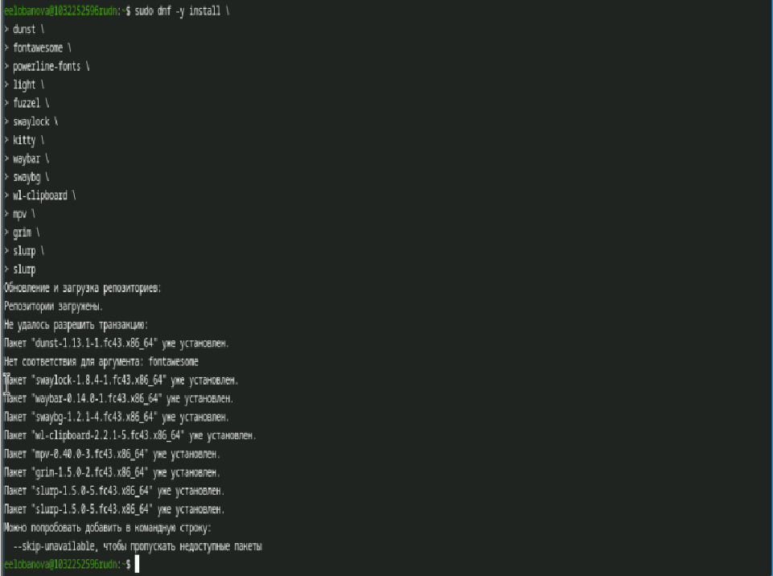
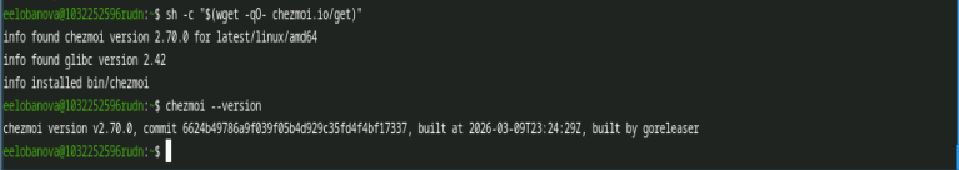

---
## Author
author:
  name: Лобанова Екатерина Евгеньевна
  orcid: 0000-0002-0877-7063
  email: 1032252596@rudn.ru
  affiliation:
    - name: Российский университет дружбы народов
      country: Российская Федерация
      postal-code: 117198
      city: Москва
      address: ул. Миклухо-Маклая, д. 6
## Title
title: Лабораторная работа 1
subtitle: Установка Fedora SWAY
license: CC BY
date: today
date-format: "YYYY-MM-DD" # Example: 2025-09-06
---

# Информация

## Докладчик

  * Лобанова Екатерина Евгеньевна
  * студент НПИбд-01-25
  * Российский университет дружбы народов им. П. Лумумбы
  * [1032252596@rudn.ru]
  * ст билет 1032252596

## Устанавливаем pass

{width=70%}

## Синхронизируем с git

{width=70%}

## Добавляем новый пароль

{width=70%}

## Устанавливаем ПО:

{width=70%}

## Установка бинарного файла

::: 
::: {.column width="30%"}

{width=70%}
:::
::::::::::::::

## Подкючение репозитория к системе

::: 
::: {.column width="30%"}

{width=70%}
:::
::::::::::::::

## вывод

Были получены навыки работы с менеджереом паролей pass
