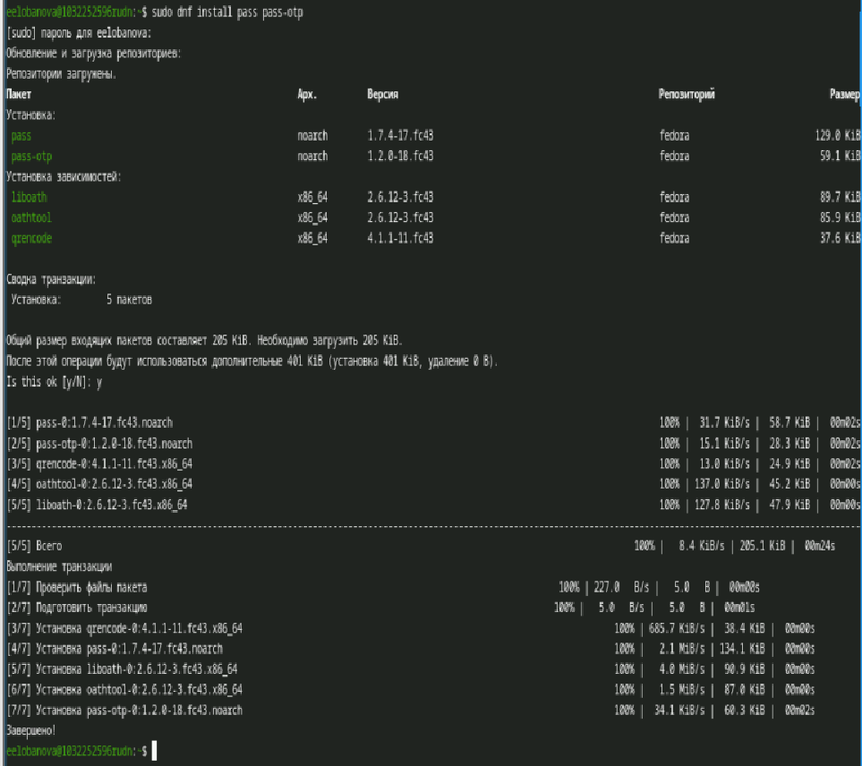
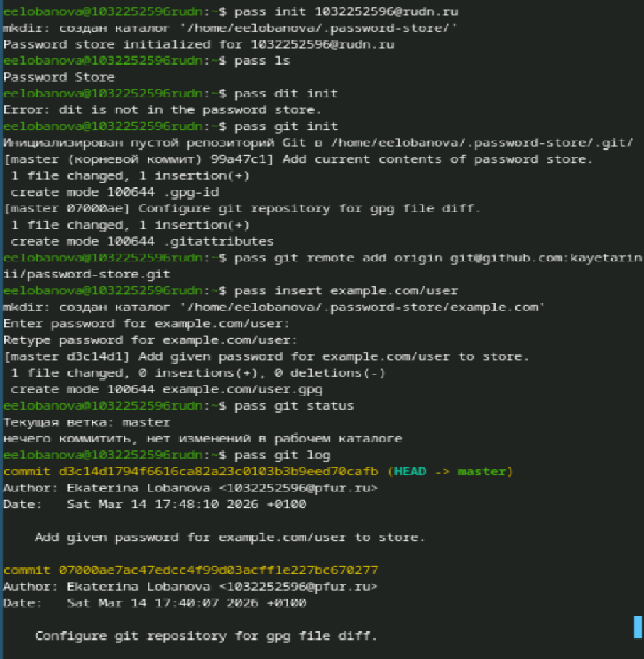
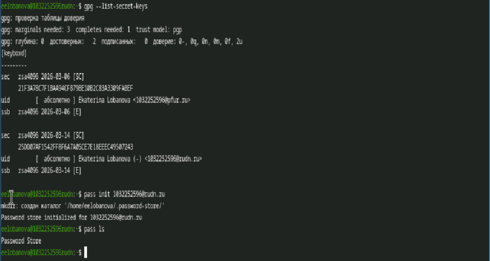

---
## Author
author:
  name: Лобанова Екатерина Евгеньевна
  degrees: DSc
  orcid: 0000-0002-0877-7063
  email: 1032252596@rudn.ru
  affiliation:
    - name: Российский университет дружбы народов
      country: Российская Федерация
      postal-code: 117198
      city: Москва
      address: ул. Миклухо-Маклая, д. 6

## Title
title: "Лабораторная работа 5"
license: "CC BY"
---

# Цель работы 

Менеджер паролей pass- программа в рамках Unix. В данной лабораторной работа занимаемся ее установкой 

# Выполнение лабораторной работы

Менеджер паролей pass ([рис. @fig-001]). ([рис. @fig-002]).([рис. @fig-003]).([рис. @fig-004]).([рис. @fig-005]).([рис. @fig-006]).

{#fig-001 width=70%}

{#fig-002 width=70%}

{#fig-003 width=70%}

{#fig-004 width=70%}

{#fig-005 width=70%}

{#fig-006 width=70%}

# Выводы

В данной лаборатороной работе мы научились раотатть с менеджером паролей pass
# Список литературы{.unnumbered}

::: {#refs}
:::
